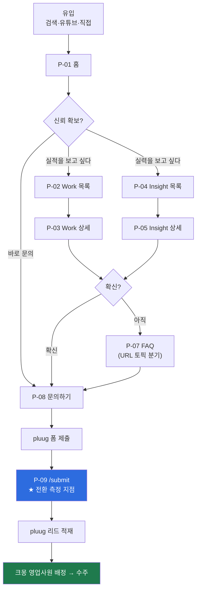
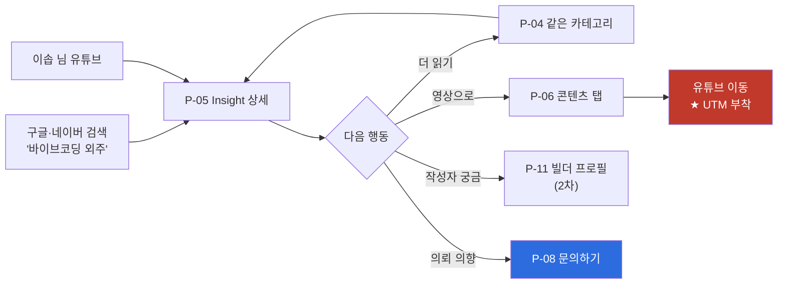
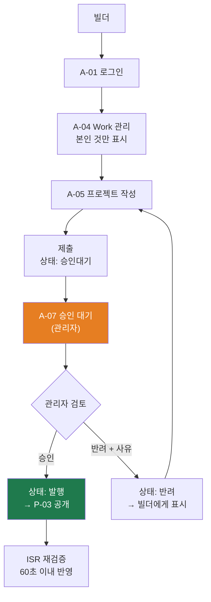
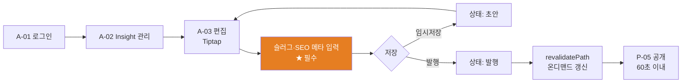
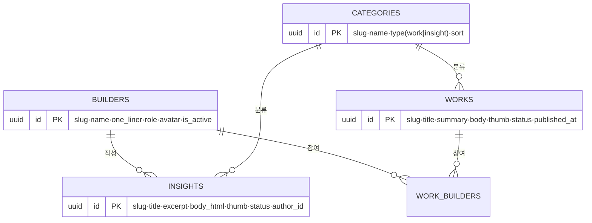

# AI 빌더 그룹 — IA · 화면목록 · 유저플로우

| | |
|---|---|
| 문서 버전 | **v1.0** |
| 작성일 | 2026-08-11 (화) |
| 상위 문서 | `[260811] AI 빌더 그룹 랜딩·관리자 플랫폼 기획서 v1.0.md` |
| 대상 독자 | 수행팀 (목업 제작 · 개발 착수용) |
| 문서 성격 | **실행 문서.** §2 화면목록이 만들 것의 전부다. 여기 없으면 만들지 않는다. |

**라벨** — 🔒 확정(클라이언트) / 🟡 팀 제안(승인 요청) / ❓ 미결(§8)

---

## 1. 전체 사이트맵

```
AI 빌더 그룹 (가제)
│
├── 공개 웹 ─────────────────────────────────────────
│   │
│   ├── 홈                    /                        P-01  🔒
│   │
│   ├── Work (포트폴리오)     /work                    P-02  🔒
│   │   └── 프로젝트 상세     /work/[slug]             P-03  🔒
│   │
│   ├── Insight (콘텐츠)      /insight                 P-04  🔒
│   │   ├── 카테고리 필터     /insight/[category]      P-04  🟡 ← 동일 템플릿
│   │   └── 아티클 상세       /insight/[slug]          P-05  🔒
│   │
│   ├── 콘텐츠·유튜브         /content                 P-06  🟡
│   │
│   ├── FAQ                   /faq/[topic]             P-07  🟡 ← 슬러그 분기
│   │
│   ├── 문의하기              /contact                 P-08  🔒
│   │   └── 제출 완료         /submit                  P-09  🟡 ← noindex
│   │
│   ├── 개인정보처리방침      /privacy                 P-10  🟡
│   │
│   └── 빌더 프로필           /builders/[slug]         P-11  ❓ ← 2차 이관 (라우트만 확보)
│
└── 관리자 ──────────────────────────────────────────
    │   (공개 GNB에 진입점 노출 안 함 · /admin 직접 접근 + 미들웨어 게이트)
    │
    ├── 로그인                /admin/login             A-01  🔒
    ├── Insight 관리          /admin/insight           A-02  🔒
    │   └── 작성·편집         /admin/insight/[id]      A-03  🔒 Tiptap
    ├── Work 관리             /admin/work              A-04  🔒
    │   └── 작성·편집         /admin/work/[id]         A-05  🔒
    ├── 빌더(유저) 관리       /admin/builders          A-06  🔒
    └── 승인 대기             /admin/approvals         A-07  🔒
```

### 1.1 GNB / Footer 🟡

| 영역 | 구성 |
|---|---|
| **GNB** | 로고 · **Work** · **Insight** · **콘텐츠** · [문의하기] (버튼형 CTA) |
| **Footer** | 브랜드 한 줄 소개 / 사이트맵 링크 / **이메일 (pluug 장애 시 대체 경로)** / 개인정보처리방침 / 사업자 정보 |

- **GNB에 관리자 링크를 넣지 않는다.** 수주용 랜딩에 백오피스 입구가 보이면 신뢰도가 떨어진다.
- **CTA는 GNB·Hero·최종 섹션 3곳으로 제한.** 근거는 "버튼 하나가 전환을 0으로 만든" 실측 사례.

---

## 2. 화면 목록 — **만들어야 하는 것의 전부**

### 2.1 공개 웹 (10화면)

| ID | 화면 | 경로 | 렌더링 | 색인 | 우선순위 | 핵심 구성 |
|---|---|---|---|---|---|---|
| **P-01** | 홈 | `/` | SSG+ISR | ✅ | **P0** | 10개 섹션 (§5) |
| **P-02** | Work 목록 | `/work` `?category=` | SSG+ISR | ✅ | **P0** | 카테고리 필터 · 카드 그리드 · 빈 상태 |
| **P-03** | Work 상세 | `/work/[slug]` | SSG+ISR | ✅ | **P0** | 히어로 / 개요 / 문제→해결 / 기술 / **참여 빌더** / 결과물 링크 / 관련 프로젝트 / CTA |
| **P-04** | Insight 목록 | `/insight` `/insight/[category]` | SSG+ISR | ✅ | **P0** | 좌측 카테고리 네비(4종) · 리스트 · 페이지네이션 |
| **P-05** | Insight 상세 | `/insight/[slug]` | SSG+ISR | ✅ | **P0** | 제목 / 발행일 / **작성자(빌더면 프로필 링크)** / 본문 / 목차 / 관련 글 / CTA |
| **P-06** | 콘텐츠·유튜브 | `/content` | SSG+ISR | ✅ | P1 | 영상 카드 그리드 · **전 링크 UTM 부착** |
| **P-07** | FAQ | `/faq/[topic]` | SSG | ✅ | P1 | 토픽 탭(**URL 분기**) · 아코디언 |
| **P-08** | 문의하기 | `/contact` | SSG | ✅ | **P0** | 안내 카피 · **pluug 폼** · 개인정보 동의 |
| **P-09** | 제출 완료 | `/submit` | SSG | ❌ noindex | **P0** | 완료 메시지 · **전환 측정 지점** |
| **P-10** | 개인정보처리방침 | `/privacy` | SSG | ✅ | P1 | 정책 본문 (문안은 클라이언트 제공) |

> **Insight 카테고리(`/insight/[category]`)는 목록과 동일 템플릿의 필터 상태**이므로 별도 화면으로 세지 않는다. 단 **URL은 반드시 분기**한다 — GA에서 카테고리별 유입을 봐야 하기 때문.

### 2.2 관리자 (7화면)

| ID | 화면 | 경로 | 접근 | 우선순위 | 핵심 구성 |
|---|---|---|---|---|---|
| **A-01** | 로그인 | `/admin/login` | 공개 | **P0** | 이메일·비밀번호 · 오류 처리 |
| **A-02** | Insight 관리 | `/admin/insight` | 관리자·빌더 | **P0** | 목록 · 상태 필터 · 검색 · 삭제 |
| **A-03** | Insight 편집 | `/admin/insight/[id]` | 관리자·빌더 | **P0** | **Tiptap** · 썸네일 · 카테고리 · **슬러그** · SEO 메타 · 이탈 확인 |
| **A-04** | Work 관리 | `/admin/work` | 관리자·빌더 | **P0** | 목록 · 상태 필터 · 삭제 |
| **A-05** | Work 편집 | `/admin/work/[id]` | 관리자·빌더 | **P0** | 이미지 · 개요 · 기술 · **참여 빌더 연결** · **슬러그** · SEO 메타 |
| **A-06** | 빌더 관리 | `/admin/builders` | **관리자만** | P1 | 계정 목록 · 권한 · 활성/비활성 · **발급·회수** |
| **A-07** | 승인 대기 | `/admin/approvals` | **관리자만** | **P0** | 대기 목록 · 미리보기 · **승인 / 반려(사유)** |

> 🟡 **로그인 후 첫 화면은 A-02(Insight 관리).** 별도 대시보드는 범위 밖(E10)이므로 만들지 않는다.

### 2.3 공통 컴포넌트 (화면과 별개로 만들어야 하는 것)

| 구분 | 항목 |
|---|---|
| 레이아웃 | GNB(스크롤 반응) · Footer · 페이지 헤더 · 섹션 래퍼 |
| 카드 | Work 카드 · Insight 카드 · 영상 카드 · 빌더 칩 |
| 요소 | CTA 버튼(3종 위치) · 카테고리 필터 · 아코디언 · 페이지네이션 · 태그 |
| 상태 | 로딩 스켈레톤 · **빈 상태(콘텐츠 0건)** · 404 · 500 |
| 인터랙션 | 스크롤 트리거 훅 · 패럴랙스 · Fixed+스크롤 연동 · **`prefers-reduced-motion` 가드** |
| 관리자 | 테이블 · 상태 배지 · 폼 필드 · **Tiptap 래퍼** · 이미지 업로더 · 확인 모달 |
| 전역 | SEO 메타 생성기 · JSON-LD · sitemap/robots/llms.txt · GA4 이벤트 래퍼 |

> ⚠️ **빈 상태를 반드시 만든다.** 오픈 시점에 Work 콘텐츠가 없을 가능성이 높다(§8 Q4). 빈 화면이 그대로 노출되면 신뢰도가 무너진다.

---

## 3. 유저 플로우

### 3.1 메인 전환 플로우 — 발주 고객 (P0)



**설계 의도**
- 어디서 진입하든 **2클릭 이내에 문의로 갈 수 있다.** 모든 상세 페이지 하단에 CTA를 둔다.
- FAQ는 **이탈 직전의 마지막 반론 해소** 자리다. 그래서 홈 하단(S9)과 독립 페이지 양쪽에 둔다.
- `/submit` 도달이 **유일한 전환 정의**다. pluug 관리화면에서 "제출 후 이동 링크"를 우리 도메인 `/submit`으로 지정해야 성립한다. ❓ 권한 확인 필요(§8 Q5).

### 3.2 콘텐츠 유입 플로우 — 검색·유튜브 (P1)



**측정 목표** — 🔒 *"인사이트 탭에서 실제로 몇 명이 유튜브로 전환됐는지"*. `/content`를 상위 탭으로 분리한 이유가 이 숫자를 오염 없이 잡기 위해서다.

### 3.3 빌더 등록 → 승인 플로우 (P0)



> ⚠️ **승인 게이트는 반드시 넣는다.** 빌더가 검토 없이 고객 노출 콘텐츠를 바로 공개하는 구조는 위험하다. 기수가 늘수록 계정이 증가하므로 **발급·회수 절차**(A-06)도 세트로 만든다.

### 3.4 관리자 콘텐츠 발행 플로우 (P0)



> **"즉시 반영"이 아니라 "60초 이내 반영"**으로 안내한다. ISR 구조에서 즉시를 약속하면 검수 분쟁이 난다.

### 3.5 콘텐츠 상태 머신 🟡

```
초안(draft) ──제출──> 승인대기(pending) ──승인──> 발행(published) ──내림──> 보관(archived)
    ↑                        │                                              │
    └──────반려(사유)────────┘                                              │
    └──────────────────────수정────────────────────────────────────────────┘
```

| 상태 | 공개 노출 | 편집 가능 | 사이트맵 |
|---|---|---|---|
| 초안 | ❌ | 작성자 | ❌ |
| 승인대기 | ❌ | 작성자(제출 후 잠금) | ❌ |
| 발행 | ✅ | 관리자 | ✅ |
| 반려 | ❌ | 작성자 (+반려 사유 표시) | ❌ |
| 보관 | ❌ | 관리자 | ❌ (301 처리) |

---

## 4. 데이터 개체 관계 🟡



- 🔒 **리드(문의) 테이블은 만들지 않는다.** 리드는 pluug가 관리하고 **우리 DB에는 콘텐츠만** 저장한다.
- 🟡 공개 쿼리에서 `select *`를 쓰지 않고 **컬럼을 명시**한다 — 빌더 비공개 컬럼이 응답에 섞이지 않도록.
- 🟡 브라우저에서 Supabase를 직접 호출하지 않는다. **서버 컴포넌트에서 페치.**

---

## 5. 홈(P-01) 섹션 구성 — 인터랙션 배정

**성공 조건 ①(딸깍 금지)의 실체가 이 표다. 인접한 두 섹션은 절대 같은 인터랙션을 쓰지 않는다.**

| # | 섹션 | 목적 | 배정 인터랙션 |
|---|---|---|---|
| S1 | **Hero** — "바이브 코딩으로 외주를 해드립니다" | 3초 안에 정체성 + 1차 CTA | 텍스트 **스태거 등장** + 배경 그라디언트 이동 |
| S2 | **문제 제기** — "이런 곳은 조심하세요" | 발주자 불안을 먼저 말함 | **Fixed + 스크롤 연동** (문구 교체) |
| S3 | **일하는 방식** — 4단계 | ★ 핵심 소구점 | **가로 스크롤 연동** |
| S4 | **검증 체계** — 똑빌더 상향 평준화 | 품질 우려 해소 | ⛔ **정지 (의도적 무애니메이션)** |
| S5 | **맞춤 매칭** | 차별화 선언 | **호버 카드 전개** |
| S6 | **Work 프리뷰** (3~4) | 실적 제시 | **Fade-in(아래→위)** + 이미지 패럴랙스 |
| S7 | **Insight 프리뷰** (3) | 전문성 제시 | ⛔ **정지 (의도적 무애니메이션)** |
| S8 | **콘텐츠·유튜브** | 유튜브 유입 | **화면 전환 퍼짐** |
| S9 | **FAQ** | 마지막 반론 해소 | 아코디언 전개 + **URL 분기** |
| S10 | **최종 CTA** | 전환 | 버튼 마이크로 인터랙션만 |

---

## 6. 트래킹 포인트 매핑 🟡

| 플로우 지점 | 이벤트 | 파라미터 |
|---|---|---|
| 전 페이지 진입 | `page_view` | 기본 |
| GNB·Hero·상세 하단 CTA 클릭 | `cta_click` | `location` |
| P-03 진입 | `work_detail_view` | `slug`, `category` |
| P-05 진입 | `insight_detail_view` | `slug`, `category`, `author_type` |
| P-06 → 유튜브 이동 | `youtube_outbound` | `video_id`, `utm_campaign` |
| P-07 토픽 전환 | `faq_topic_change` | `topic` (URL 분기 세트) |
| **P-09 도달** | **`contact_submit`** | **★ 전환 지표** |

**UTM 규격** — `?utm_source=builder-group&utm_medium=content|insight|work&utm_campaign=<슬러그>&utm_content=<노출위치>`

> `/submit` 직접 방문으로 인한 가짜 전환은 `referrer` 조건 또는 토큰으로 필터링한다.

---

## 7. 만들어야 하는 것 — 체크리스트

### 7.1 1차 범위 (3주)

| 구분 | 항목 | 수 |
|---|---|---|
| 공개 화면 | P-01 ~ P-10 | **10** |
| 관리자 화면 | A-01 ~ A-07 | **7** |
| **합계** | | **17화면** |
| 공통 컴포넌트 | §2.3 전체 | — |
| 전역 세팅 | SEO 테크니컬 / GA4·UTM / pluug 연동 / 반응형 3종 / 접근성 기준선 | — |

### 7.2 만들지 않는 것 (요청 시 별도 산정)

매칭 기능 · 리드/CRM · AX 컨설팅 · 3사 소개 · 고객 회원가입 · 결제/견적 · 다국어 · 통합 검색 · 실시간 채팅 · 관리자 대시보드 · **빌더 프로필 상세(P-11, 라우트만 확보)** · GEO/AEO 별도 최적화

### 7.3 착수 전 확정해야 하는 것

- [ ] **슬러그 규칙** — 확정 후 리다이렉트 없이 바꾸면 색인이 소멸한다 (§8 Q7)
- [ ] **pluug 연동 방식과 폼 설정 권한** — 전환 측정의 마지막 단 (§8 Q5)
- [ ] **Work 오픈 콘텐츠** — 없으면 빈 상태로 오픈 (§8 Q4)
- [ ] **도메인** — canonical·OG·GA 속성이 여기 묶임 (§8 Q2)

---

## 8. 미결 — IA에 직접 영향을 주는 것만

| # | 항목 | IA 영향 | 기본 결정 |
|---|---|---|---|
| **Q2** | 최종 도메인 | canonical·sitemap·OG 절대경로 | 신규 도메인 전제, 상대경로 설계 후 환경변수 1곳 교체 |
| **Q4** | Work 오픈 콘텐츠 | P-02·P-03이 빈 화면이 될 수 있음 | 똑개 실적 전용 전제 + **빈 상태 컴포넌트 필수 구현** |
| **Q5** | pluug 연동 방식 | P-08 구조, P-09 성립 여부 | 직링크 + `/submit` 리다이렉트 |
| **Q6** | 빌더 프로필 범위 | P-11, `builders` 스키마 | **라우트만 확보, 기능은 2차 이관** |
| **Q7** | 슬러그에 고객사명 포함 | 전 상세 페이지 URL | 고객사명 제외, 동의 확인 건만 사후 추가 |
| **A** | 유튜브 탭 위치 | GNB 항목 수, P-06 존재 여부 | **상위 탭 분리** (측정 목표 때문) |

---

*상세 배경·근거는 상위 문서 `[260811] AI 빌더 그룹 랜딩·관리자 플랫폼 기획서 v1.0.md` 참조.*
